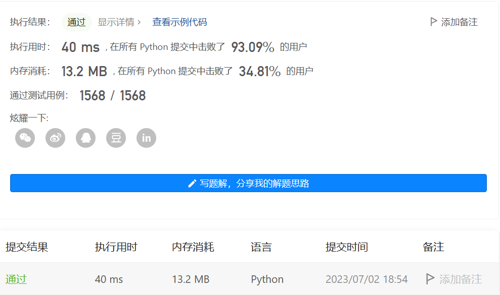

[TOC]
# 题目
[题目链接](https://leetcode.cn/problems/add-two-numbers)
题目详情：
You are given two non-empty linked lists representing two non-negative integers. The digits are stored in reverse order, and each of their nodes contains a single digit. Add the two numbers and return the sum as a linked list.

You may assume the two numbers do not contain any leading zero, except the number 0 itself.

 

Example 1:


Input: l1 = [2,4,3], l2 = [5,6,4]
Output: [7,0,8]
Explanation: 342 + 465 = 807.
Example 2:

Input: l1 = [0], l2 = [0]
Output: [0]
Example 3:

Input: l1 = [9,9,9,9,9,9,9], l2 = [9,9,9,9]
Output: [8,9,9,9,0,0,0,1]
 

Constraints:

The number of nodes in each linked list is in the range [1, 100].
0 <= Node.val <= 9
It is guaranteed that the list represents a number that does not have leading zeros.

来源：力扣（LeetCode）
链接：https://leetcode.cn/problems/add-two-numbers
著作权归领扣网络所有。商业转载请联系官方授权，非商业转载请注明出处。

# 解法
## 解法一
### 解题思路
常规解题思路是将每个链表的值反过来变成整数，然后两个整数相加，相加完成后，再把两个整数相加的和反向输出成链表。
举个例子：
Example 1:
Input: l1 = [2,4,3], l2 = [5,6,4]
Output: [7,0,8]
Explanation: 342 + 465 = 807.

输入的l1链表反过来变成整数是342<br>
输入的l2链表反过来变成整数是465<br>
两者相加是 342+465=807
再将807反向输出变成链表，那么就是 7->0->8。

### 解题代码
直接运行可以直接运行解法一代码
```python
# Definition for singly-linked list.
# class ListNode(object):
#     def __init__(self, val=0, next=None):
#         self.val = val
#         self.next = next
class Solution(object):
    def addTwoNumbers(self, l1, l2):
        """
        :type l1: ListNode
        :type l2: ListNode
        :rtype: ListNode
        """
        def get_number(s, type):
            if not s or s is None:
                return 0
            string_result = ""
            while s:
                string_result += str(s.val)
                s = s.next
            if type == "int":
                return int(string_result[::-1])
            if type == "str":
                return string_result[::-1]

        l1_int = get_number(l1, "int")
        l2_int = get_number(l2, "int")
        l1_l2_add_reverse = str(l1_int+l2_int)[::-1]

        dummy = ListNode(0)
        cur = dummy
        for i in range(len(l1_l2_add_reverse)):
            cur.next = ListNode(l1_l2_add_reverse[i])
            cur = cur.next
        return dummy.next
```


### 提交结果


## 解法二
### 解题思路
既然链表表示的数是倒序的，那么直观的想法是，直接将链表对应的数值相加。
需要注意的点就是，进位。超过10及其以上，取个位数，十位数进。 <br>
注意：
1、jinwei在每次计算进位后需要清零
2、如果末尾数字相加大于10，则需要将进位弄成一个节点
举个例子，

Example 1:
Input: l1 = [9,9], l2 = [5,6,4]
Output: [4,6,5]
Explanation: 99 + 465 = 564.

l1: 9->9
L2: 5->6->4

对应位置数值相加，其中，每次位数相加的时候，进位jinwei值取十位数，当前值取个位数
9+5+jinwei = 14
此时，jinwei 清零。
因为 14 >= 10，因此该节点值是4，jinwei=1

==========

jinwei = 1
9+6+jinwei = 16
此时，jinwei 清零。
因为 16 >= 10，因此该节点值是6，jinwei=1


==========
jinwei = 1
4+jinwei = 5
此时，jingwei清零。

==========
连起来，就是，4-6-5

### 解题代码
详细运行见解法二代码，这里有一个延申知识点，就是链表反转。链表反转思路如下： <br>
[链表反转题目](https://leetcode.cn/problems/UHnkqh/)
链表反转代码：
```python
# Definition for singly-linked list.
# class ListNode(object):
#     def __init__(self, val=0, next=None):
#         self.val = val
#         self.next = next
class Solution(object):
    def reverseList(self, head):
        """
        :type head: ListNode
        :rtype: ListNode
        """
        if not head or head is None:
            return head

        tmp = None
        
        while head:
            cur = head.next
            head.next = tmp
            tmp = head
            head = cur
        
        return tmp
```

该题代码如下：
```python
# Definition for singly-linked list.
# class ListNode(object):
#     def __init__(self, val=0, next=None):
#         self.val = val
#         self.next = next
class Solution(object):
    def addTwoNumbers(self, l1, l2):
        """
        :type l1: ListNode
        :type l2: ListNode
        :rtype: ListNode
        """

        dummy = ListNode(0)
        cur = dummy

        
        jinwei = 0
        mowei = 0

        while l1 and l2:
            add_int = l1.val + l2.val+jinwei
            jinwei = 0
            mowei = add_int
            if add_int >= 10:
                jinwei = add_int // 10
                add_int = add_int - jinwei * 10
            cur.next = ListNode(add_int)
            cur = cur.next
            l1 = l1.next
            l2 = l2.next

        while l1:
            add_int = l1.val + jinwei
            jinwei = 0
            mowei = add_int
            if add_int >= 10:
                jinwei = add_int // 10
                add_int = add_int - jinwei * 10
            cur.next = ListNode(add_int)
            cur = cur.next
            l1 = l1.next


        while l2:
            add_int = l2.val + jinwei
            jinwei = 0
            mowei = add_int
            if add_int >= 10:
                jinwei = add_int // 10
                add_int = add_int - jinwei * 10
            cur.next = ListNode(add_int)
            cur = cur.next
            l2 = l2.next

        if jinwei > 0 and mowei >= 10:
            cur.next = ListNode(jinwei)

        return dummy.next
```

### 提交结果

